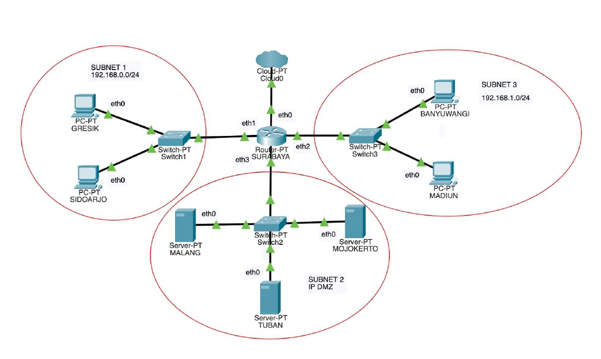
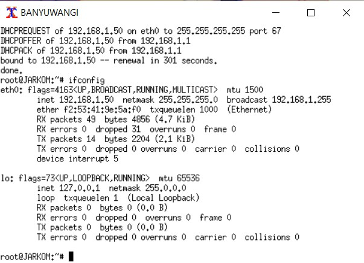

# Modul3_C09
Kelompok C09
- 05111840000028  M. Frediansyah Sinaga
- 05111840000072  Kresna Adhi Pramana

Praktikum Modul 3 berupa *Dynamic Host Configuration Protocol (DHCP) dan Proxy Server*.

## Soal
Anri adalah seorang mahasiswa tingkat akhir yang sedang mengerjakan TA mengenai DHCP dan Proxy.
Bu Meguri sebagai dosen pembimbing Anri memberikan tugas pertamanya, (1) yaitu untuk membuat
topologi jaringan demi kelancaran TA-nya dengan kriteria sebagai berikut:

Anri sudah pernah mempelajari teknik Jaringan Komputer sehingga Anri dapat membuat topologi
tersebut dengan mudah. Bu Meguri memerintahkan Anri untuk menjadikan SURABAYA sebagai
router, MALANG sebagai DNS Server, TUBAN sebagai DHCP server, serta MOJOKERTO sebagai Proxy
server, dan UML lainnya sebagai client.
Bu Meguri berpesan pada Anri untuk menyusun topologi secara hati-hati dan memperhatikan
gambar topologi yang diberikan Bu Meguri.

Karena TUBAN jauh dari client, maka perlu adanya perantara agar bisa saling terhubung. (2)
SURABAYA ditunjuk sebagai perantara ( DHCP Relay ) antara DHCP Server dan client.

Kriteria lain yang diminta Bu Meguri pada topologi jaringan tersebut adalah:
1. Seluruh client TIDAK DIPERBOLEHKAN menggunakan konfigurasi IP Statis.
2. (3) Client pada subnet 1 mendapatkan range IP dari 192.168.0.10 sampai 192.168.0.100 dan
    192.168.0.110 sampai 192.168.0.200.
3. (4) Client pada subnet 3 mendapatkan range IP dari 192.168.1.50 sampai 192.168.1.70.
4. (5) Client mendapatkan DNS Malang dan DNS 202.46.129.2 dari DHCP
5. (6) Client di subnet 1 mendapatkan peminjaman alamat IP selama 5 menit, sedangkan (6) client
    pada subnet 3 mendapatkan peminjaman IP selama 10 menit.

Bu Meguri adalah dosbing yang suka overthinking . Ia tidak ingin jaringan lokalnya terhubung ke
internet secara langsung. Sehingga ia memberi tugas tambahan pada Anri untuk membuatkan Proxy
sebagai penghubung jaringan lokal ke internet. Ada beberapa ketentuan yang harus dipenuhi dalam
pembuatan Proxy ini.

Pertama, akses ke proxy hanya bisa dilakukan oleh Anri sendiri sebagai user TA. (7) User autentikasi
milik Anri memiliki format:
* User : userta_yyy
* Password : inipassw0rdta_yyy
Keterangan : yyy adalah nama kelompok masing-masing. Contoh: userta_c01

Anri sudah menjadwal pengerjaan TA-nya (8) setiap hari Selasa-Rabu pukul 13.00-18.00 . Bu Meguri
membatasi penggunaan internet Anri hanya pada jadwal yang telah ditentukan itu saja. Maka diluar
jam tersebut, Anri tidak dapat mengakses jaringan internet dengan proxy tersebut. Jadwal bimbingan
dengan Bu Meguri adalah (9) setiap hari Selasa-Kamis pukul 21.00 - 09.00 keesokan harinya (sampai
Jumat jam 09.00) . Agar Anri bisa fokus mengerjakan TA, (10) setiap dia mengakses google.com, maka
akan di redirect menuju monta.if.its.ac.id agar Anri selalu ingat untuk mengerjakan TA🙂.

Untuk menandakan bahwa Proxy Server ini adalah Proxy yang dibuat oleh Anri, (11) Bu Meguri
meminta Anri untuk mengubah error page default squid menjadi seperti berikut:

* Note : File error page bisa diunduh dengan cara wget 10.151.36.202/error403.tar.gz
* Extract : tar -xvf error403.tar.gz

## Jawaban
1. Membuat topologi jaringan

2. SURABAYA ditunjuk sebagai perantara (DHCP Relay) antara DHCP Server dan client.
    1. Kita ketikkan perintah ifconfig untuk mengetahui IP kita(pada server dhcp, yaitu TUBAN) (10.151.77.84)
    2. Install DHCP Server di TUBAN
    3. Atur interface dengan  nano /etc/default/isc-dhcp-server , interface yang dipilih adalah eth0 karena akan direlay.
    
    4. Konfigurasi DHCP dengan nano /etc/dhcp/dhcpd.conf
    
    5. Install isc-dhcp-relay di SURABAYA
    6. Isi konfigurasi isc-dhcp-relay seperti berikut :
    
    7. Restart DHCP Server
* Seluruh client TIDAK DIPERBOLEHKAN menggunakan konfigurasi IP Statis.
    * Ubah IP pada setiap client dengan menambahkan :
	    * auto eth0
        * iface eth0 inet dhcp
    * Dan comment konfigurasi lama disetiap Client.
    
    * Lalu lakukan perintah service networking restart pada setiap klien
    * Testing
        * GRESIK 
	
        * SIDOARJO
	
        * BANYUWANGI
	
        * MADIUN
	
3. Client pada subnet 1 mendapatkan range IP dari 192.168.0.10 sampai 192.168.0.100 dan 192.168.0.110 sampai 192.168.0.200.

4. Client pada subnet 3 mendapatkan range IP dari 192.168.1.50 sampai 192.168.1.70.

5. Client mendapatkan DNS Malang dan DNS 202.46.129.2 dari DHCP

    1. Testing (cat /etc/resolv.conf)
    
6. Client di subnet 1 mendapatkan peminjaman alamat IP selama 5 menit, sedangkan client pada subnet 3 mendapatkan peminjaman IP selama 10 menit.

7. User autentikasi milik Anri memiliki format:
    * User : userta_yyy
    * Password : inipassw0rdta_yyy
    * Keterangan : yyy adalah nama kelompok masing-masing. Contoh: userta_c01
    1. Install Squid di MOJOKERTO
    
    2. Backup data konfigurasi Squid `mv /etc/squid/squid.conf /etc/squid/squid.conf.bak`
    3. Install Apache2-Utils
    4. Buat User dan Password sesuai format dengan menggunakan perintah : 
        * htpasswd -c /etc/squid/password userta_c09
        * Username, : userta_c09
        * Password : inipassw0rdta_c09
	
    5. Edit Konfigurasi squid-nya
    
    6. Restart Squid
    7. Testing
    
8. Setiap hari Selasa-Rabu pukul 13.00-18.00. Bu Meguri membatasi penggunaan internet Anri hanya pada jadwal yang telah ditentukan itu saja. Maka diluar jam tersebut, Anri tidak 
    dapat mengakses jaringan internet dengan proxy tersebut.
    1. Buat file baru bernama acl.conf di folder squid
    2. Edit file acl.conf
    3. Edit file Squid menjadi :
    4. Restart squid
    5. Testing (coba akses diluar jam yang telah ditentukan (08:08 AM))
9. Jadwal bimbingan dengan Bu Meguri adalah setiap hari Selasa-Kamis pukul 21.00 - 09.00 keesokan harinya (sampai Jumat jam 09.00).
    1. Edit file acl.conf , tambahkan JADWAL_BIMBINGAN
    2. Edit file squid :
10. Agar Anri bisa fokus mengerjakan TA, setiap dia mengakses google.com, maka akan di redirect menuju monta.if.its.ac.id agar Anri selalu ingat untuk mengerjakan TA🙂.
    1. Edit Squid dengan menambahkan url_regex dan deny info
    2. Testing dengan membuka : http://www.google.com/
11. Untuk menandakan bahwa Proxy Server ini adalah Proxy yang dibuat oleh Anri, (11) Bu Meguri meminta Anri untuk mengubah error page default squid
    1. Unduh File error di :
        `wget 10.151.36.202/ERR_ACCESS_DENIED`  
    2. Replace fire ERR_ACCES_DENIED yang ada di /usr/share/squid/errors/English/
    3. Testing (buka elearning.if.its.ac.id)
12. Karena Bu Meguri dan Anri adalah tipe orang pelupa, maka untuk memudahkan mereka, Anri memiliki ide ketika menggunakan proxy cukup dengan mengetikkan domain janganlupa-
    ta.yyy.pw dan memasukkan port 8080.
    1. Install bind9 di Malang
    2. Edit named.conf.local seperti ini :
    3. Buat folder jarkom
    4. Copykan file db.local pada path /etc/bind ke dalam folder jarkom yang baru saja dibuat dan ubah namanya menjadi janganlupa-ta.c09.pw
    5. Edit file janganlupa-ta.c09.pw menjadi :
    6. Restart bind9
    7. Coba ubah proxy di firefox menggunakan janganlupa-ta.c09.pw dengan port 8080
	8. Test buka elearning.if.its.ac.id
